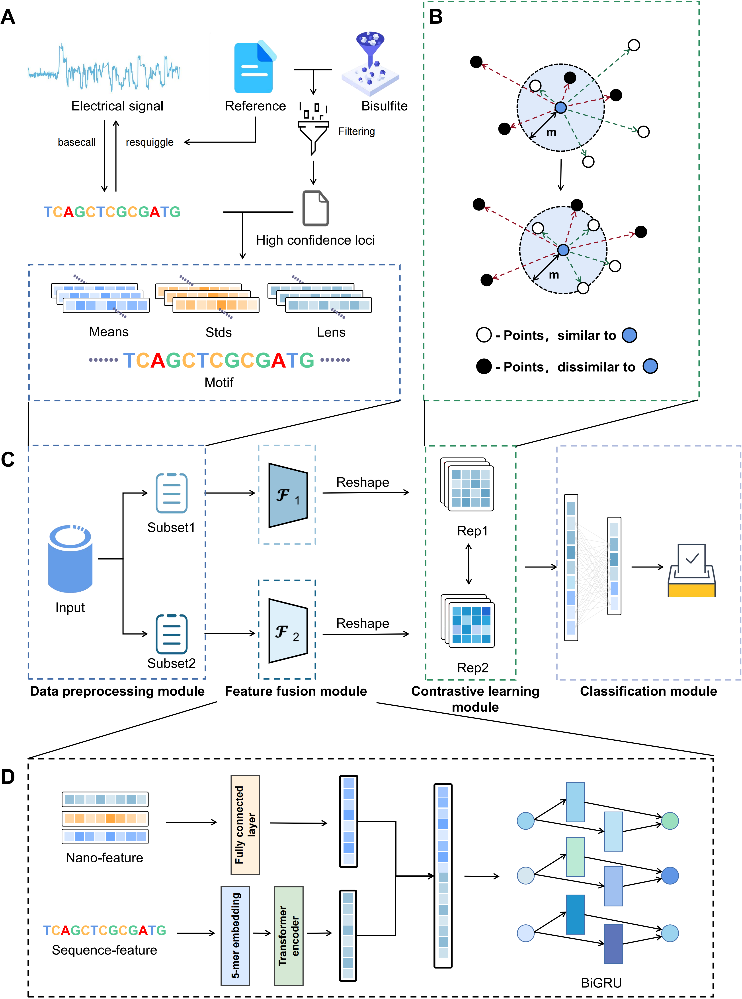

# NanoCon

[](https://example.com)      [](https://example.com)  [](https://example.com)  [](https://example.com)

## Project Overview

5-Methylcytosine (5mc), a fundamental element of DNA methylation in eukaryotes, plays a vital role in gene expression regulation, embryonic development, and other biological processes. Although several computational methods have been proposed for detecting the base modifications in DNA like 5mc sites from Nanopore sequencing data, they face challenges including sensitivity to noise, and ignoring the imbalanced distribution of methylation sites in real-world scenarios. Here, we develop NanoCon, a deep hybrid network coupled with contrastive learning strategy to detect 5mc methylation sites from Nanopore reads. In particular, we adopted a contrastive learning module to alleviate the issues caused by imbalanced data distribution in nanopore sequencing, offering a more accurate and robust detection of 5mc sites. Evaluation results demonstrate that NanoCon outperforms existing methods, highlighting its potential as a valuable tool in genomic sequencing and methylation prediction. Additionally, we also verified the effectiveness of our representation learning ability on two datasets by visualizing the dimension reduction of the features of methylation and non-methylation sites from our NanoCon. Furthermore, cross-species and cross-5mc methylation motifs experiments indicated the robustness and the ability to perform transfer learning of our model. We hope this work can contribute to the community by providing a powerful and reliable solution for 5mc site detection in genomic studies.
<!--  -->

## Installation

### 1. Cloning the Project

First, you need to clone the project repository from GitHub to your local machine. You can do this by running the following command in your terminal:

```bash
git clone https://github.com/your-username/NanoCon.git
```

This command will create a copy of the NanoCon project in your current working directory.

### 2. Setting Up the Environment

After cloning the project, the next step is to set up the project environment. This project uses Conda, a popular package and environment management system. To create the environment with all the required dependencies, navigate to the project directory and run:

```bash
cd NanoCon
conda env create -f environment.yml
```

This command will read the environment.yml file and create a new Conda environment with the name specified in the file. It will also install all the dependencies listed in the file.

### 3. Activating the Environment

Once the environment is created, you need to activate it. To do so, use the following command:

```bash
conda activate NanoCon_env
```

Replace **NanoCon_env** with the actual name of the environment, as specified in the **environment.yml** file.

## Data Preprocessing

### Overview

In this project, we place a strong emphasis on the accuracy and consistency of our data preprocessing steps. To ensure the reliability of our results, we have adopted a data preprocessing approach that is identical to that used in the [DeepSignal-Plant](https://github.com/PengNi/deepsignal-plant) project. This method has been proven to be effective and efficient in handling complex genomic data.

### Process

Our data preprocessing involves several key steps:

1. **Data Cleaning**: We begin by cleaning the raw data to remove any inconsistencies or errors. This includes filtering out low-quality reads and trimming adapters.

2. **Normalization**: The data is then normalized to ensure uniformity across different samples. This step is crucial for accurate downstream analysis.

3. **Feature Extraction**: We extract relevant features from the cleaned and normalized data, which are then used for further analysis and model training.

4. **Quality Control**: Throughout the preprocessing stage, we conduct rigorous quality control checks to maintain the integrity of the data.

### Detailed Guidelines

For a detailed walkthrough of the preprocessing steps, we highly recommend referring to the [DeepSignal-Plant GitHub repository](https://github.com/PengNi/deepsignal-plant). Their repository provides comprehensive guidelines and scripts that we have closely followed in our project. This approach ensures that our data is prepared in a manner that is both consistent with established practices and optimized for our specific analytical needs.

### Why This Approach?

By aligning our preprocessing steps with those used in the DeepSignal-Plant project, we aim to maintain a high standard of data quality and comparability. This consistency is vital for the reproducibility of our results and facilitates more accurate comparisons with other studies in the field.

We appreciate your interest in our data preprocessing methods. For any further queries or detailed discussions, feel free to open an issue in our GitHub repository.

## Quick Start Guide

This guide provides instructions on how to run the deep learning program for training and testing purposes. The program allows for various operational modes and parameters to be set via command-line arguments.

### 1.Prerequisites

Ensure you have Python and the necessary libraries installed.

### 2.Running the Program

To run the program, use the following command in the terminal:

python train.py --mode [mode] [additional_arguments]

### 3.Command-Line Arguments

- --mode (required): Operating mode of the script. Choose between train for training the model and test for testing the model.
- --seed (optional): Sets the random seed for reproducibility. Default is 42.
- --train_data (optional in test mode): Path to the training dataset.
- --val_data (optional): Path to the validation dataset. Needed if --mode is train.
- --test_data (optional in train mode): Path to the testing dataset.
- --use_gpu (optional): Flag to enable GPU usage if available.
- --checkpoint (optional in train mode): Path to the model checkpoint for testing.
- --batch_size (optional): Batch size for training and testing. Default is 512.
- --epochs (optional): Number of epochs for training. Default is 50.
- --save_model_path (optional in test mode): Path to save the trained model.

### 4.Examples

**4.1 Training the Model**

```bash
   python train.py --mode train --train_data /path/to/train_data --val_data /path/to/val_data \
   --batch_size 512 --epochs 50 -save_model_path /path/to/save_model
```

**4.2 Testing the Model**

```bash
   python train.py --mode test --test_data /path/to/test_data --checkpoint /path/to/checkpoint
```

### Note

- Ensure the paths to datasets and model checkpoints are correctly specified.
- For GPU usage, --use_gpu flag can be set, and the script will automatically allocate available GPU resources.

This guide should help you quickly set up and run the training and testing processes for the deep learning model.

## License

This project is licensed under the MIT License - see the [LICENSE](LICENSE) file for details.
